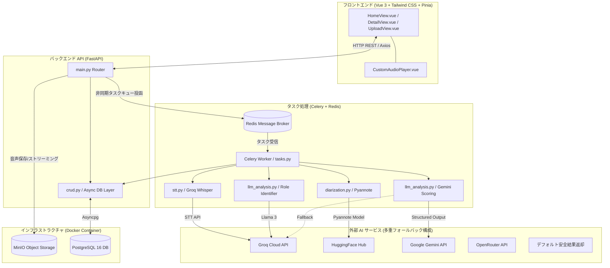
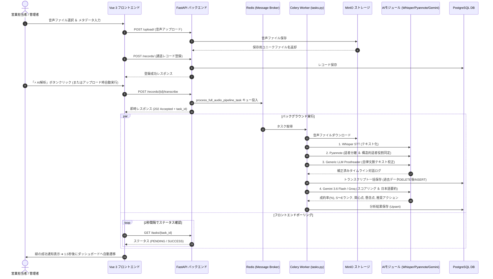

# 🚀 テレセールス・アナリティクス・ダッシュボード システム仕様書

## 1. システム概要
本システム（テレセールス見込み顧客スコアリングシステム）は、アウトバウンド型電話営業（テレセールス）における通話音声を自動でテキスト化・話者識別し、最先端の生成AI（Gemini 2.5 Flash / Llama 3.3 70B）を用いて成約率の判定（S〜Eランクスコアリング）、要約、シグナル抽出を行う高度AIインサイドセールス支援プラットフォームです。

---

## 2. 技術スタック (Tech Stack)

| カテゴリ | 採用技術・サービス | 用途・詳細 |
| :--- | :--- | :--- |
| **フロントエンド** | Vue 3 (Composition API), Vite | ダッシュボード画面構築・SPA |
| | Tailwind CSS (v3) | レスポンシブ＆ダークモードUIスタイリング |
| | Pinia | アップロード状態管理・ストア |
| | Vue Router 4 | ルーティング制御（`/`, `/upload`, `/records/:id`） |
| | Axios | REST API クライアント（Base URL一元管理） |
| | Lucide Vue Next | モダンアイコンセット |
| **バックエンド** | Python 3.12, FastAPI, Uvicorn | 高速非同期 REST API サーバー |
| | Celery 5.4, Redis 7 | バックグラウンド非同期タスク処理キュー |
| | SQLAlchemy 2.0 (AsyncSession), Alembic | ORM / DBマイグレーション管理 |
| | Pydantic v2 | データバリデーション・Structured Output定義 |
| **AI / LLM** | Groq Whisper (whisper-large-v3-turbo) | 高精度・超高速日本語音声テキスト化 (STT: language="ja", temperature=0.0, 領域プロンプト) |
| | Pyannote Audio (speaker-diarization-3.0) | タイムスタンプ別話者分離 (Diarization) ＆ 構造的話者役割同定 (Sales vs Customer) |
| | Generic LLM Proofreader (Gemini / Groq) | 汎用文脈自律テキスト校正（語頭切断切断補正・誤音素自律修復） |
| | Groq LLM (openai/gpt-oss-120b) | 二次フォールバック用LLM (日本語出力厳格強制プロンプト適用) |
| | Google Gemini API (gemini-3.6-flash) | 通話要約・シグナル抽出・Pydantic Structured Output スコアリング (Primary AI, temperature=0.1, Few-shot) |
| | OpenRouter API (mistralai/mistral-7b-instruct:free) | 三次フォールバック用LLM API (クォータ枯渇時保護) |
| **インフラ / DB** | PostgreSQL 16 (Docker) | メインリレーショナルデータベース |
| | MinIO (Docker) | S3互換オブジェクトストレージ (音声ファイル格納) |
| | Redis 7 (Docker) | Celery用インメモリメッセージブローカー / バックエンド |

---

## 3. 分類ランク表記標準（Wording & Labeling Specifications）

本システムでは、顧客の反応およびAIスコアリング結果に基づき、以下の分類ランク基準を厳格に適用します。

| ランク | 正式名称 (パラメータ) | 成約率 (％) 基準 | UI表示ルール |
| :---: | :--- | :---: | :--- |
| **S** | **非常に有望** | 90% 〜 100% | 絞り込み: `[S：非常に有望]` ｜ カード右上: `S` ｜ パラメータ: `非常に有望` |
| **A** | **有望** | 70% 〜 89% | 絞り込み: `[A：有望]` ｜ カード右上: `A` ｜ パラメータ: `有望` |
| **B** | **検討中** | 50% 〜 69% | 絞り込み: `[B：検討中]` ｜ カード右上: `B` ｜ パラメータ: `検討中` |
| **C** | **観察** | 30% 〜 49% | 絞り込み: `[C：観察]` ｜ カード右上: `C` ｜ パラメータ: `観察` |
| **D** | **低可能性** | 10% 〜 29% | 絞り込み: `[D：低可能性]` ｜ カード右上: `D` ｜ パラメータ: `低可能性` |
| **E** | **不可行** | 0% 〜 9% | 絞り込み: `[E：不可行]` ｜ カード右上: `E` ｜ パラメータ: `不可行` |

- **表記統一ルール**:
  - `成約可能性（購入確率）` ➔ 必ず **`成約率`** と表記。
  - `文字起こし` ➔ **`AI解析`** または **`対話ログ`** と表記。
  - `専用詳細画面 ↗` ➔ **`詳細画面 ↗`** と表記。
  - `簡易表示 ▼ / 簡易表示閉じる ▲` ➔ **`表示 ▼ / 非表示 ▲`** と表記。

---

## 4. フロントエンド UI / UX 仕様

1. **ダッシュボード画面 (`HomeView.vue`)**:
   - **トップナビゲーションタブ**: `📋 通話データ一覧` と `🏆 営業担当者別 パフォーマンス` の2タブ切替。
   - **表示モード切替（テーブル ⇄ カード）**: デフォルトで視認性に優れた**テーブル形式（表 `<table>`）**表示を採用し、ツールバーのスイッチ（`📊 テーブル` / `🎴 カード`）で従来のグリッドカード配置への即時切り替えが可能。
   - **営業担当者別パフォーマンス分析 ＆ 小サンプルバイアス修正**: 担当者ごとの平均成約率、総通話数、S/Aランク獲得数を集計。少件数の運による上位独占を防ぐため「🔥 S/Aランク獲得数順」「⚖️ 総合補正スコア順」「📈 平均成約率順」「📞 総架電件数順」の並び替え切替をサポート。
   - **🏆 メダル色紙吹雪演出 (Confetti)**: パフォーマンスランキング上位1位〜3位のカード内部に、金・銀・銅の浮遊紙吹雪アニメーションが舞い降る視覚エフェクトを搭載。
   - **⏱️ 対話ログ ⇄ 音声連動ピンポイント再生**: 時系列対話ログの発話バブルをクリックすると、専用音声プレイヤーがその発話の開始秒（例: `▶ 15.2s`）へ自動シークし即時再生。
   - **📊 Talk-to-Listen Ratio（対話割合メーター）**: 営業 vs 顧客の発話時間を自動計算し、「営業話しすぎ注意 (65%超)」「理想的な対話バランス」などの判定バッジとグラデーションメーターを表示。
   - **💡 顧客の懸念・ボトルネック自動ハイライト**: 顧客発話から「価格」「検討持ち帰り」「決裁」「競合比較」「ネック」を自動検知し、カラータグバッジおよび警告発光枠線で可視化。
2. **システム環境設定・ユーザー管理画面 (`SettingsView.vue`)**:
   - **👥 ユーザー管理タブ**: 新規ユーザーの追加登録（ID、氏名、役職・権限、パスワード）および削除機能。
   - **⚙️ AI解析・評価基準設定タブ**: Gemini/Groq/OpenRouter APIキーの設定・保存、AIプロバイダー選択、S/A/B/C/Dランク判定閾値設定、AIカスタムプロンプト指示の編集。
3. **アカウントログイン画面 (`LoginView.vue`)**:
   - アカウント認証（ユーザー名・パスワード）画面。ワンクリックで `admin` 管理者等として試せるデモアカウントログイン枠を完備。
4. **専用カスタム音声プレイヤー (`CustomAudioPlayer.vue`)**:
   - 音量コントロールはホバー/タップ時に**上向き縦型ポップオーバー** (`writing-mode: vertical-lr`) で展開し、再生タイムラインシークバーとの干渉を完全に防ぐ構造。`seekToAndPlay` メソッドを公開し対話ログクリック再生に連動。
5. **新規アップロード画面 (`UploadView.vue`)**:
   - ファイル選択時に **`✖ 選択解除`** ボタンを完備。
   - Celery 解析完了時に成功通知を表示し、**1.5秒後にダッシュボード (`/`) へ自動リダイレクト**。
6. **日時タイムゾーン自動変換**:
   - DBに保存された UTC 日時 ISO 文字列に `Z` を自動補正し、JST（日本標準時 UTC+9, `YYYY/MM/DD HH:mm`）形式に正確に変換して表示。

---

## 5. 全体アーキテクチャ構成図

---

## 6. 通話処理シーケンス図 (非同期処理パイプライン)

