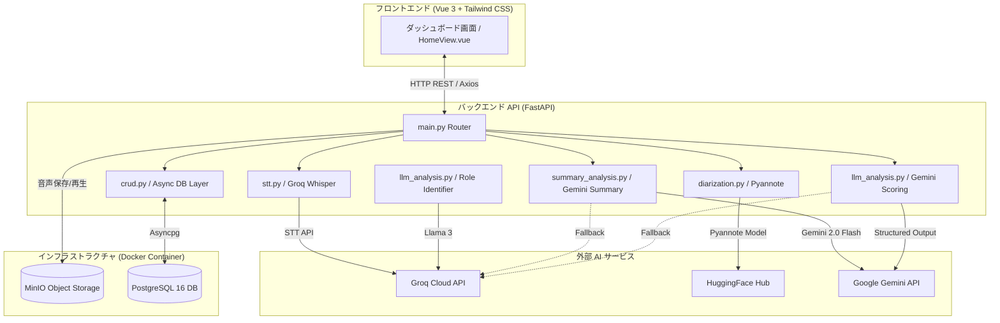
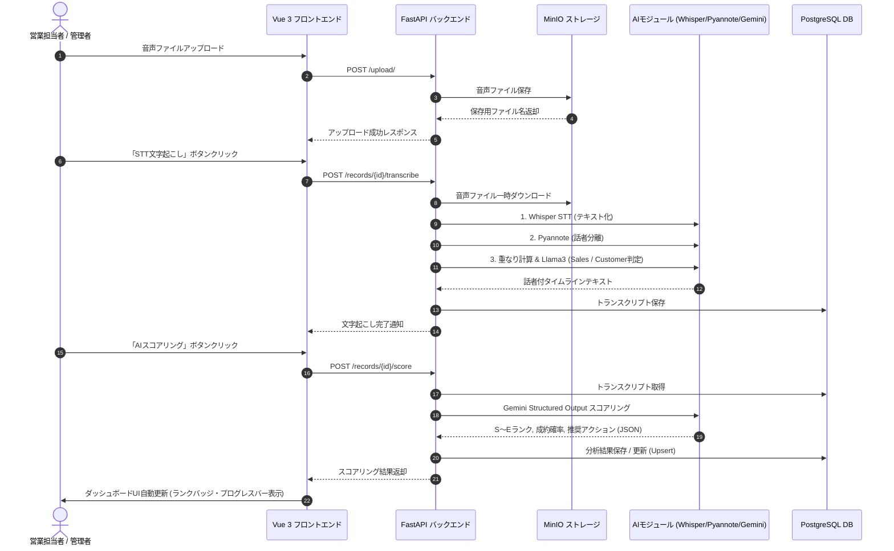
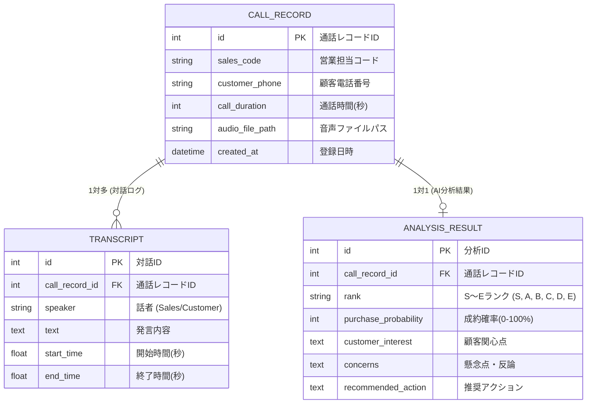

# 🚀 テレセールス・アナリティクス・ダッシュボード システム仕様書

## 1. システム概要
本システム（テレセールス見込み顧客スコアリングシステム）は、アウトバウンド型電話営業（テレセールス）における通話音声を自動でテキスト化・話者識別し、最先端の生成AI（Gemini 2.0 Flash / Llama 3.3 70B）を用いて成約見込み度の判定（S〜Eランクスコアリング）、要約、シグナル抽出を行う高度AIインサイドセールス支援プラットフォームです。

---

## 2. 技術スタック (Tech Stack)

| カテゴリ | 採用技術・サービス | 用途・詳細 |
| :--- | :--- | :--- |
| **フロントエンド** | Vue 3 (Composition API), Vite | ダッシュボード画面構築・SPA |
| | Tailwind CSS (v3) | レスポンシブ＆ダークモードUIスタイリング |
| | Axios | REST API クライアント（Base URL一元管理） |
| **バックエンド** | Python 3.12, FastAPI, Uvicorn | 高速非同期 REST API サーバー |
| | SQLAlchemy 2.0 (AsyncSession), Alembic | ORM / DBマイグレーション管理 |
| | Pydantic v2 | データバリデーション・Structured Output定義 |
| **AI / LLM** | Groq Whisper (whisper-large-v3-turbo) | 高精度・超高速日本語音声テキスト化 (STT) |
| | Pyannote Audio (speaker-diarization-3.1) | タイムスタンプ別話者分離 (Diarization) |
| | Groq Llama 3.3 70B (llama-3.3-70b-versatile) | 話者役割判定 (Sales vs Customer) |
| | Google Gemini API (gemini-2.0-flash) | 通話要約・シグナル抽出・Pydantic Structured Output スコアリング |
| **インフラ / DB** | PostgreSQL 16 (Docker) | メインリレーショナルデータベース |
| | MinIO (Docker) | S3互換オブジェクトストレージ (音声ファイル格納) |

---

## 3. 全体アーキテクチャ構成図

---

## 4. 通話処理シーケンス図 (処理パイプライン)

---

## 5. データベース設計書 (ER図)

---

## 6. API設計書 (主要エンドポイント)

| HTTPメソッド | エンドポイント | 説明 | リクエスト / レスポンス仕様 |
| :--- | :--- | :--- | :--- |
| `POST` | `/upload/` | 音声ファイルアップロード | `multipart/form-data` ➔ 保存ファイル名返却 |
| `POST` | `/records/{id}/transcribe` | STT文字起こし ＆ 話者分離 | Whisper + Pyannote ＋ Llama3 実行 ＆ DB保存 |
| `POST` | `/records/{id}/summarize` | AI通話要約 ＆ シグナル抽出 | Gemini 2.0 Flash 実行（要約・シグナル返却） |
| `POST` | `/records/{id}/score` | AIスコアリング実行 | Gemini Structured Output 実行 ＆ DB保存 (Upsert) |
| `GET` | `/records/` | 全通話記録・分析結果の取得 | レスポンス: 一覧データ（JSON） |
| `GET` | `/records/{id}/export/csv` | CSVレポート出力 | レスポンス: BOM付き UTF-8 CSVファイル |
