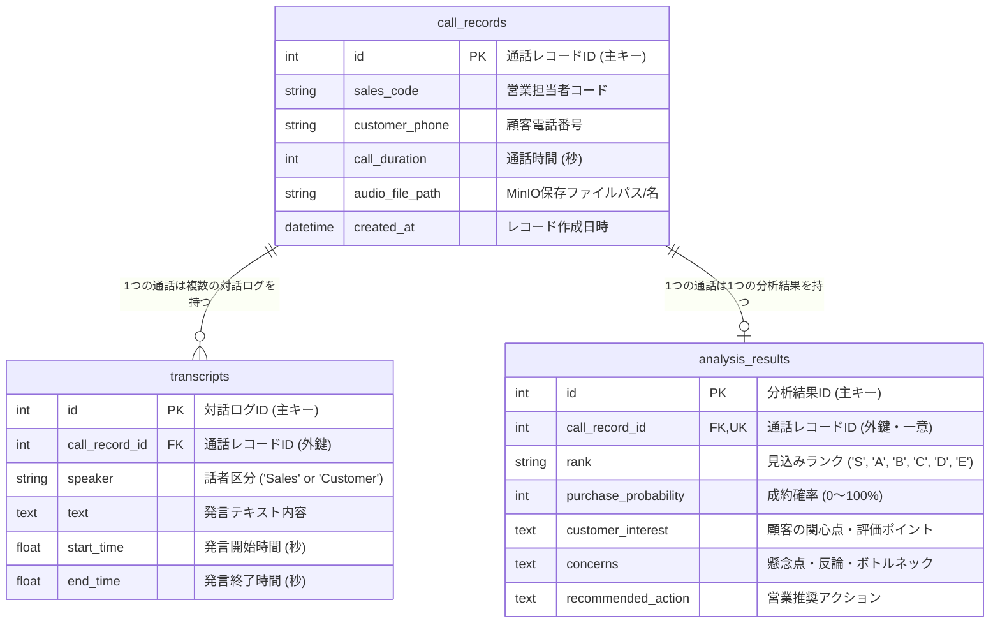

# 🗄️ データベース設計書 (Database Specification)

## 1. 概要
本データベースは、テレセールスにおける通話データ、話者識別付き文字起こし対話ログ、AIスコアリング・要約分析結果を保持・管理するリレーショナルデータベースである。

- **DBMS**: PostgreSQL 16
- **接続ドライバー**: `asyncpg` (Python 非同期ドライバ)
- **ORM**: SQLAlchemy 2.0 (`AsyncSession`)
- **マイグレーションツール**: Alembic

---

## 2. ER図 (Entity-Relationship Diagram)

---

## 3. テーブル定義一覧

### 3.1. `call_records` テーブル（通話基本情報）
通話の基本的なメタ情報および音声ファイルのパスを管理する。

| カラム名 | 物理名 | データ型 | 制約 | 説明 |
| :--- | :--- | :--- | :--- | :--- |
| 通話レコードID | `id` | `INTEGER` | `PRIMARY KEY, AUTOINCREMENT` | 通話データの一意キー |
| 営業担当コード | `sales_code` | `VARCHAR(255)` | `NOT NULL, INDEX` | 営業担当者の識別コード |
| 顧客電話番号 | `customer_phone` | `VARCHAR(255)` | `NOT NULL` | 発信先顧客の電話番号 |
| 通話時間 | `call_duration` | `INTEGER` | `NOT NULL` | 通話全体の秒数 |
| 音声ファイルパス | `audio_file_path` | `VARCHAR(512)` | `NULLABLE` | MinIO上に保存されたオブジェクト名 |
| 作成日時 | `created_at` | `TIMESTAMP WITH TIME ZONE` | `NOT NULL, DEFAULT NOW()` | データ登録日時 |

---

### 3.2. `transcripts` テーブル（話者付き文字起こし対話ログ）
Groq Whisper および Pyannote / Llama 3 によって処理された時系列対話データを保持する。

| カラム名 | 物理名 | データ型 | 制約 | 説明 |
| :--- | :--- | :--- | :--- | :--- |
| 対話ログID | `id` | `INTEGER` | `PRIMARY KEY, AUTOINCREMENT` | 対話一連の一意キー |
| 通話レコードID | `call_record_id` | `INTEGER` | `FOREIGN KEY (call_records.id ON DELETE CASCADE), NOT NULL` | 親通話レコードへの参照キー |
| 話者区分 | `speaker` | `VARCHAR(50)` | `NOT NULL` | `'Sales'`（営業）または `'Customer'`（顧客） |
| 発言内容 | `text` | `TEXT` | `NOT NULL` | 文字起こし・自動整形されたテキスト |
| 発言開始秒 | `start_time` | `FLOAT` | `NOT NULL` | 通話開始時からの経過開始秒 |
| 発言終了秒 | `end_time` | `FLOAT` | `NOT NULL` | 通話開始時からの経過終了秒 |

---

### 3.3. `analysis_results` テーブル（AIスコアリング・分析結果）
Gemini 2.0 Flash の Structured Output により抽出された見込みランク・成約確率・要約・推奨アクションを保存する。

| カラム名 | 物理名 | データ型 | 制約 | 説明 |
| :--- | :--- | :--- | :--- | :--- |
| 分析結果ID | `id` | `INTEGER` | `PRIMARY KEY, AUTOINCREMENT` | 分析データの一意キー |
| 通話レコードID | `call_record_id` | `INTEGER` | `FOREIGN KEY (call_records.id ON DELETE CASCADE), UNIQUE, NOT NULL` | 親通話レコードへの参照キー（1対1） |
| 見込みランク | `rank` | `VARCHAR(10)` | `NOT NULL` | `'S'`, `'A'`, `'B'`, `'C'`, `'D'`, `'E'` のいずれか |
| 成約確率 | `purchase_probability` | `INTEGER` | `NOT NULL` | 0 〜 100 のパーセンテージ |
| 顧客関心点 | `customer_interest` | `TEXT` | `NULLABLE` | 顧客が興味を示したポイント |
| 懸念点 | `concerns` | `TEXT` | `NULLABLE` | 顧客が提示した懸念・反論 |
| 推奨アクション | `recommended_action` | `TEXT` | `NULLABLE` | 次に営業担当者がとるべき具体策 |

---

## 4. リレーションおよび削除カスケード方針
- **`call_records` (1) ➔ `transcripts` (N)**:
  - 親 `call_record` が削除された場合、関連する `transcripts` も連動して削除される（`CASCADE DELETE`）。
- **`call_records` (1) ➔ `analysis_results` (1)**:
  - `call_record_id` に `UNIQUE` 制約を付与し、1つの通話に対して常に最新のスコアリング結果が1件のみ存在する状態を保つ（`create_or_update_analysis_result` による Upsert 制御）。
