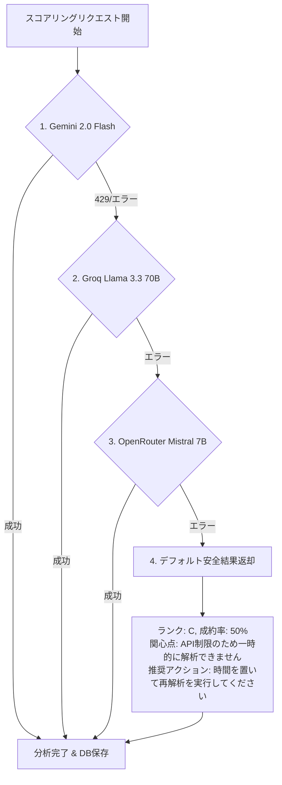

# 🤖 AI / LLM プロンプト ＆ スコアリング仕様書

## 1. 採用モデルと役割分担 (Model Architecture)

| モデル名 | 提供事業者 | 処理タスク | 選定理由・特徴 |
| :--- | :--- | :--- | :--- |
| **`whisper-large-v3-turbo`** | Groq Cloud | 音声認識・文字起こし (STT) | 超高速推論 (リアルタイム比10倍以上)・日本語認識精度 |
| **`speaker-diarization-3.1`** | Pyannote / HuggingFace | 話者分離 (Speaker Diarization) | タイムスタンプ別話者セグメント抽出のデファクトスタンダード |
| **`llama-3.3-70b-versatile`** | Groq Cloud | 話者役割判定 ＆ 二次フォールバック | 構造的対話推論・超低遅延レスポンス・Geminiダウン時バックアップ |
| **`gemini-2.0-flash`** | Google Cloud / Gemini API | メインAIスコアリング (Primary) | 大規模文脈受容・Native Structured Output (Pydantic連動) |
| **`mistral-7b-instruct`** | OpenRouter | 三次フォールバック (Tertiary) | 無料枠クォータ制限時の冗長化バックアップAPI |

---

## 2. 分類ランク定義と成約率の連動ルール

本システムにおける S〜E ランクの判定基準および表記ルールは以下の通りです。

| ランク | 正式名称 (パラメータ) | 成約率 (％) 範囲 | 評価内容・見込み状態 |
| :---: | :--- | :---: | :--- |
| **S** | **非常に有望** | **90% 〜 100%** | 即時導入意思あり、契約手続き・見積提示確定 |
| **A** | **有望** | **70% 〜 89%** | 高い関心あり、具体検討・上長共有段階 |
| **B** | **検討中** | **50% 〜 69%** | 前向きな興味あり、他社比較・課題検討段階 |
| **C** | **観察** | **30% 〜 49%** | 情報収集段階、緊急性は低く継続的な観察が必要 |
| **D** | **低可能性** | **10% 〜 29%** | 難色あり、予算不足や現状維持の意向 |
| **E** | **不可行** | **0% 〜 9%** | ターゲット外、明確な拒絶、競合長期契約中 |

---

## 3. プロンプト設計仕様

### 3.1. 話者役割判定プロンプト (`backend/llm_analysis.py`)
アウトバウンド・テレセールスの構造的原則（発信側が先に名乗る）に基づき、Whisper＋Pyannoteの出力テキストから Sales（営業）と Customer（顧客）を厳密判定する。

```text
あなたはプロフェッショナルな音声対話解析AIです。以下のデータは「企業から顧客へかけたアウトバウンドのテレセールス（電話営業）」の文字起こしログです。
各セリフが「営業担当者（Sales）」のものか、「顧客（Customer）」のものかを論理的に判定してください。

【アウトバウンド・テレセールスの構造的原則】
1. 営業担当者 (Sales) の定義:
   - この通話は営業側から発信しているため、時間の流れにおいて最初に発言し、自社名や自身の名前を名乗る人物は必ず営業担当者です。
   - 用件の切り出し、「お時間よろしいでしょうか」というアポイントの打診、およびクロージングを行います。
2. 顧客 (Customer) の定義:
   - 営業からの呼びかけに対して応答する側です。
   - 「こんにちは」「お電話ありがとうございます」という第一声の応答や、自身の状況伝達を行います。

【会話ログ】
{full_sample}

【出力形式】
JSON形式で、各セリフのID（文字列の数字）をキー、判定結果（"Sales" または "Customer"）を値にしたオブジェクトのみを出力してください。
```

---

### 3.2. Gemini Structured Output スコアリングプロンプト (`backend/llm_analysis.py`)
Pydantic スキーマ `schemas.AnalysisResultBase` を `response_schema` に与え、型安全な成約率・ランク判定を行う。
1%単位の精細なスコアリングを実現するため、4つの観点（各0〜25点）に基づくルーブリック細密評価プロンプトと `temperature=0.5` を採用し、ランク（S〜E）はバックエンドで自動導出する。

- **Pydantic スキーマ構造**:
  ```python
  class AnalysisResultBase(BaseModel):
      rank: str = Field(..., description="S, A, B, C, D, Eのいずれか1文字")
      purchase_probability: int = Field(..., ge=0, le=100, description="0から100までの整数（%）")
      customer_interest: str = Field(..., description="顧客が示唆した関心点や評価しているポイント")
      concerns: str = Field(..., description="顧客の懸念点、反論、またはボトルネック")
      recommended_action: str = Field(..., description="営業担当者が次にとるべき具体的な推奨アクション")
  ```

- **ルーブリック細密評価スコアリングプロンプト**:
  ```text
  あなたはプロのインサイドセールス分析AIです。以下の電話営業の対話ログを細かく評価し、
  顧客の成約意欲・成約率 (`purchase_probability`: 0〜100の数値) を算出してください。

  【数値算出指示 (ルーブリック細密評価)】
  以下の4つの観点（各0〜25点）を個別に厳密に評価し、その合計点（0〜100）を `purchase_probability` としてください。
  1. 顧客の関心・質問の積極性 (0〜25点)
  2. 課題感・導入意欲の深さ (0〜25点)
  3. 次回アクション・スケジュールの具体性 (0〜25点)
  4. 懸念・反論リスクの少なさ (0〜25点)

  ※ 80, 60, 50, 40 などの典型的な5や10の倍数に丸めず、各観点の加算結果によるリアルな1%単位の数値（例: 83, 76, 62, 49, 27, 8 など）を正確に算出してください。

  【対話ログ】
  {dialogue_text}
  ```

---

## 4. フェイルセーフ ＆ 多重冗長化機構 (4-Stage Fallback Architecture)

AI API の利用制限（429 Too Many Requests）やサーバーダウン、ネットワーク障害に備え、4段階の自動フォールバックチェーンを実装。システム全体の無限待機やフリーズを防止。



1. **第1優先 (Primary)**: `gemini-2.0-flash`
   - Native Pydantic Structured Output により高精度・低遅延でスコアリングを実行。
2. **第2優先 (Secondary Fallback)**: `llama-3.3-70b-versatile` (Groq API)
   - Gemini が 429 レートリミットやダウン状態の場合、自動的に Groq API に切替。
3. **第3優先 (Tertiary Fallback)**: `mistralai/mistral-7b-instruct:free` (OpenRouter API)
   - Groq API も制限に達した場合、httpx 同期クライアント経由で OpenRouter 無料枠モデルを呼び出し。
4. **第4優先 (Quaternary / Safe Default Return)**: 安全なデフォルト値返却
   - すべての外部 AI API が停止した場合でもシステムは応答を止めず、ランク `C`（成約率 `50%`）、`customer_interest="API制限のため一時的に解析できません"`、`recommended_action="APIの利用制限（429）または通信エラーが発生しました。時間を置いて再解析を実行してください。"` という安全な例外結果オブジェクトを生成して正常終了する。
