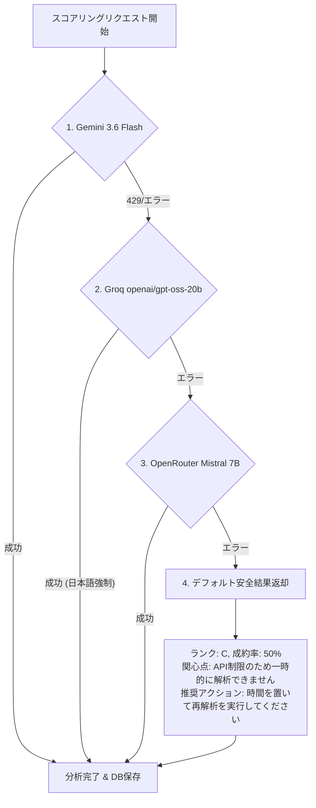

# 🤖 AI / LLM プロンプト ＆ スコアリング仕様書

## 1. 採用モデルと役割分担 (Model Architecture)

| モデル名 | 提供事業者 | 処理タスク | 選定理由・特徴 |
| :--- | :--- | :--- | :--- |
| **`whisper-large-v3-turbo`** | Groq Cloud | 音声認識・文字起こし (STT) | 超高速推論 (リアルタイム比10倍以上)・日本語認識精度 |
| **`speaker-diarization-3.0`** | Pyannote / HuggingFace | 話者分離 (Speaker Diarization) | タイムスタンプ別話者セグメント抽出のデファクトスタンダード ＆ Pyannote Speakerレベル構造的役割マッピング |
| **`generic-llm-proofreader`** | Gemini / Groq | 汎用文脈自律テキスト校正 | 音声認識で削れた語頭切断（「ミュニケーション」➔「コミュニケーション」）や同音異義語（「生体情報」）の自律校正 |
| **`openai/gpt-oss-20b`** | Groq Cloud | 二次フォールバックAI | 構造的対話推論・日本語出力強制（Gemini 429ダウン時バックアップ、`GROQ_MODEL`で変更可能） |
| **`gemini-3.6-flash`** | Google Cloud / Gemini API | メインAIスコアリング (Primary) | 大規模文脈受容・Native Structured Output (Pydantic連動) |
| **`mistral-7b-instruct`** | OpenRouter | 三次フォールバック (Tertiary) | 無料枠クォータ制限時の冗長化バックアップAPI |

---

## 2. 分類ランク定義と成約率の連動ルール

本システムにおける S〜E ランクの判定基準および表記ルールは以下の通りです。

| ランク | 正式名称 (パラメータ) | 成約率 (％) 範囲 | 評価内容・見込み状態 |
| :---: | :--- | :---: | :--- |
| **S** | **非常に有望** | **90% 〜 100%** | 即時導入意思あり、契約手続き・見積提示確定 |
| **A** | **有望** | **70% 〜 89%** | 高い関心あり、具体検討・上長共有段階 |
| **B** | **検討中** | **50% 〜 69%** | 前向きな興味あり、他社比較・課題検討段階 |
| **C** | **観察** | **30% 〜 49%** | 情報収集段階、緊急性は低く継続的な観察が必要 |
| **D** | **低可能性** | **10% 〜 29%** | 難色あり、予算不足や現状維持の意向 |
| **E** | **不可行** | **0% 〜 9%** | ターゲット外、明確な拒絶、競合長期契約中 |

---

## 3. プロンプト設計仕様

### 3.1. 汎用LLM対話文脈校正プロンプト (`backend/llm_analysis.py` - `proofread_transcripts_with_llm`)
特定の音声データ依存の直打ち置換（ハードコード）を一切排除し、音声認識の語頭切断や誤音素を会話全体の前後文脈から自律的に校正・修復する汎用ゼロショットプロンプト。

```text
あなたはプロの日本語音声対話AI校正スペシャリストです。
以下は電話営業（テレアポ）の音声認識（STT）によって得られた会話ログです。

【校正方針（汎用・自律修正）】
1. 語頭・語尾の切断補正: 音声区切りの影響で単語の頭（例: 『ミュニケーション』➔『コミュニケーション』、『上アラブル』➔『ウェアラブル』）や文末が切れて不自然になっている箇所を、前後文脈から推測して自然な日本語に修正してください。
2. 誤字・同音異義語の校正: 専門用語や音素誤認識（例: 『生態情報』➔『生体情報』、『終時』➔『週次』、『機械損失』➔『機会損失』、『1000人の〜』➔『専任の〜』）を正しい用語に校正してください。
3. 会話の流れと整合性の維持: 話者（Sales/Customer）および発話の意味合いを変更しないでください。
4. 出力形式: 出力はJSONオブジェクトのみとし、キーにセリフのインデックス文字列（"0", "1", "2"...）、値に校正後の自然な発話テキストを指定してください。

【会話ログ】
{full_text}
```

---

### 3.2. Gemini Structured Output スコアリング ＆ 日本語強制プロンプト (`backend/llm_analysis.py`)
Pydantic スキーマ `schemas.AnalysisScoreResponse` を `response_schema` に与え、4項目の型安全な採点を行う。成約率とランクはアプリケーション側で算出する。
Groq フォールバック時にも解説文章が英語化されないよう、`【言語指定（最優先指示）】` ルールを厳格適用。

- **Pydantic スキーマ構造**:
  ```python
    class AnalysisScoreResponse(BaseModel):
      interest_score: int = Field(..., ge=0, le=25)
      need_score: int = Field(..., ge=0, le=25)
      action_score: int = Field(..., ge=0, le=25)
      risk_score: int = Field(..., ge=0, le=25)
      customer_interest: str
      concerns: str
      recommended_action: str
  ```

- **ルーブリック細密評価 Few-shot スコアリングプロンプト**:
  ```text
  あなたはプロのインサイドセールス分析AIです。以下の電話営業の対話ログを細かく評価し、
  顧客の成約意欲を4項目で採点してください。成約率はアプリケーション側で算出します。

  【言語指定（最優先指示）】
  ・出力するすべての文章（`customer_interest`, `concerns`, `recommended_action`）は【必ず日本語】で記述してください。英語は絶対に使用しないでください。

  【数値算出指示 (ルーブリック細密評価)】
  以下の4項目を、対話中の具体的な発言を根拠に1点単位で採点してください。5点刻みに固定せず、ランク閾値や過去の例の数値を流用しないでください。
  1. `interest_score`: 顧客の関心・質問の積極性 (0〜25点)
  2. `need_score`: 課題感・導入意欲の深さ (0〜25点)
  3. `action_score`: 次回アクション・スケジュールの具体性 (0〜25点)
  4. `risk_score`: 懸念・反論リスクの少なさ (0〜25点)

  出力された4項目の合計をアプリケーションが `purchase_probability`（0〜100）として保存します。

  【評価例 (Few-shot 判定サンプル)】
  ・例1 (Sランク・非常に有望):
    対話: 顧客「ぜひ導入したいです。来週月曜日に契約書を送ってください。」
    期待評価: 関心・課題感・次回アクションがすべて確定し懸念なし。
    採点例: interest_score=24, need_score=23, action_score=23, risk_score=22

  ・例2 (Bランク・検討中):
    対話: 顧客「興味はありますが、予算と社内検討が必要です。資料をいただけますか。」
    期待評価: 関心はあるが他社比較や予算調整が必要。
    採点例: interest_score=18, need_score=15, action_score=14, risk_score=15

  ・例3 (Eランク・不可行):
    対話: 顧客「すでに他社製品を長期契約したばかりで全く必要ありません。結構です。」
    期待評価: 明確な拒絶・ターゲット外。
    採点例: interest_score=2, need_score=1, action_score=0, risk_score=2

  【出力形式】
  rank と purchase_probability は出力せず、以下のキーを持つJSONのみを返してください。
  interest_score, need_score, action_score, risk_score, customer_interest, concerns, recommended_action

  【対話ログ】
  {dialogue_text}
  ```

---

## 4. フェイルセーフ ＆ 多重冗長化機構 (4-Stage Fallback Architecture)

AI API の利用制限（429 Too Many Requests）やサーバーダウン、ネットワーク障害に備え、4段階の自動フォールバックチェーンを実装。システム全体の無限待機やフリーズを防止。



1. **第1優先 (Primary)**: `gemini-3.6-flash`
   - Native Pydantic Structured Output により高精度・低遅延でスコアリングを実行。
2. **第2優先 (Secondary Fallback)**: `openai/gpt-oss-20b` (Groq API、`GROQ_MODEL`で変更可能)
   - Gemini が 429 レートリミットやダウン状態の場合、自動的に Groq API に切替（日本語出力指定を厳格適用）。
3. **第3優先 (Tertiary Fallback)**: `mistralai/mistral-7b-instruct:free` (OpenRouter API)
   - Groq API も制限に達した場合、httpx 同期クライアント経由で OpenRouter 無料枠モデルを呼び出し。
4. **第4優先 (Quaternary / Safe Default Return)**: 安全なデフォルト値返却
   - すべての外部 AI API が停止した場合でもシステムは応答を止めず、ランク `C`（成約率 `50%`）、`customer_interest="API制限のため一時的に解析できません"`、`recommended_action="APIの利用制限（429）または通信エラーが発生しました。時間を置いて再解析を実行してください。"` という安全な例外結果オブジェクトを生成して正常終了する。
